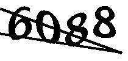
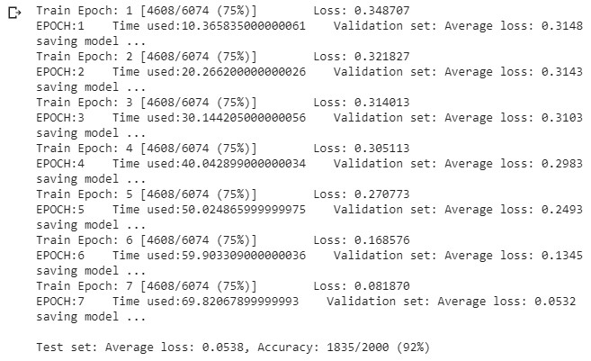

# SEU-captcha-recognition
recognition of verification code in jwc.seu.edu.cn using CNN implemented with PyTorch

### About



这个项目使用PyTorch构建了卷积神经网络，用于训练对SEU教务处验证码的识别。之前尝试过使用Tesseract OCR，但是发现识别正确率太低了，不到30%

所以尝试使用CNN来识别，CNN的结构很简单，重点是如何获得训练需要的标注好的数据集。有两种思路：

1. 模仿教务处生成验证码的方式，自己编写程序生成验证码并标注
2. 从教务处网站上下载验证码，使用[Google OCR](https://cloud.google.com/vision/docs/ocr?refresh=1)进行识别，再使用识别结果模拟登录，若登录成功则保存图片和标注结果。这样生成数据集（关于Google OCR的使用，可以参考[Google Cloud Platform 入门指南](https://hardy.home.blog/2019/08/11/google-cloud-platform-%e5%85%a5%e9%97%a8%e6%8c%87%e5%8d%97/)）

我采用的是第二种方式，构建数据集的代码在```vercode_auto_tagging.py```中，如果你想自己运行的话需要自己配置好你的API，具体可以参考上面的那个链接，下面是我调用Google的API的后台数据截图：


最后得到的数据集一共有一万张图片，其中6000张用于训练，4000张用于测试集和验证集。**最后得到的模型有90%的识别准确率**（可能是数据集还是小了一点）

### 使用训练好的模型
你需要这个目录中的：
- ```img```folder
- ```jwc_captcha_recog.py```
- ```jwc_model.pt```（在上一层目录中）

将想要识别的图片放在```img```文件夹中，运行```jwc_captcha_recog.py```就会将识别结果打印在控制台中

### 训练模型
- [下载](https://github.com/wolverinn/seu_GPACalculator/releases/tag/v3.1)并解压```jwc.rar```，里面包含了训练集，验证集，和测试集
- 我的神经网络结构：三层卷积和池化层，包括激活层，两层全连接层，一层dropout
- ```jwc_captcha_cnn.py```里面包含了训练，验证和测试的代码，运行结果：

